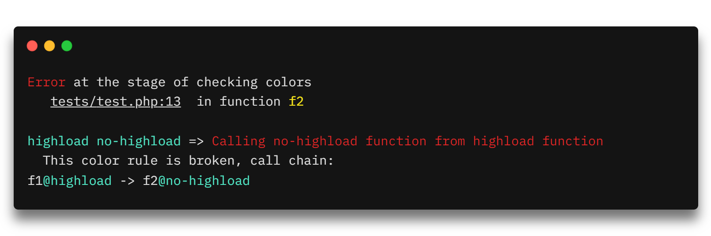

  

# nocolor

**NoColor** is an *architecture checking tool* based on the [*concept of colors*](https://github.com/vkcom/nocolor/blob/master/docs/concept_of_colors.md). This concept was originally created
for [KPHP](https://github.com/VKCOM/kphp), however, to be usable outside the KPHP, this separate tool was created.

**NoColor** tries to be fast, at the moment—about **100k lines of code per second** on Core i5.

This tool is built on top of [NoVerify](https://github.com/VKCOM/noverify) and written in Go.

## Table of Contents

- [Install](https://github.com/vkcom/nocolor/blob/master/docs/install.md)
- [Getting Started](https://github.com/vkcom/nocolor/blob/master/docs/usage.md)
- [Description of the color concept](https://github.com/vkcom/nocolor/blob/master/docs/concept_of_colors.md)
- [Comparison with Deptrac](https://github.com/vkcom/nocolor/blob/master/docs/nocolor_vs_deptrac.md)
- [How it works](https://github.com/vkcom/nocolor/blob/master/docs/how_it_work.md)

## Contributing

Feel free to contribute to this project.

## License

This project is under the **MIT License**. See the [LICENSE](https://github.com/vkcom/nocolor/blob/master/LICENSE) file
for the full license text.