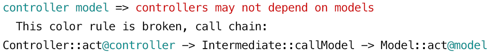
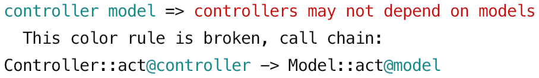

# Comparison with Deptrac

[**Deptrac**](https://github.com/qossmic/deptrac) is a popular tool for checking architecture through the concept of layers and rules. 

The goal of NoColor is pretty much the same: it searches for bad architectural patterns. But [the concept of colors](/docs/introducing_colors.md) is more flexible. 

There are some fundamental differences, as NoColor was initially invented to embrace a wide range of patterns.


## Deptrac finds only direct dependencies

<p align="center">
    
</p>

Let's play around "controllers may not depend on models". Here is a sample working code:

```php
class Controller {
    static function act() {
        Model::act();
    }
}

class Model {
    static function act() {
        // ...
    }
}
```

<details> 
    <summary>With a `depfile.yaml`, disallowing this dependence</summary> 

```yaml
paths:
  - ./
layers:
- name: Controller
  collectors:
  - type: className
    regex: .*Controller.*
- name: Model
  collectors:
  - type: className
    regex: .*Model.*
ruleset:
  # nothing here
  # (it's a white list, that's why all dependencies are denied)
```
</details>

Here Deptrac shows a violation, as expected.

**But if we insert an intermediate call, the violation won't be triggered**:
```php
class Controller {
    static function act() {
        Intermediate::callModel();
    }
}

class Intermediate {
    static function callModel() {
        Model::act();
    }
}

class Model {
    static function act() {
        // ...
    }
}
```

As pointed out, Deptrac finds only direct calls. It means, that any layer of abstraction will suddenly break the logic — while we actually didn't get rid of the dependency, we've just added some abstractions to our code.

**NoColor will find this dependency at any depth**. Let's colorize our code:
```php
/** @color controller */
class Controller { /* ... */ }

/* ... */

/** @color model */
class Model { /* ... */ }
```

Having this ruleset in the `palette.yaml`:
```yaml
compare with deptrac:
- controller model: controllers may not depend on models
```

The `nocolor check` command will trigger an expected error, printing out a call chain:

<p align="center">
    
</p>

It doesn't matter, how many intermediate calls will occur between the desired colors: NoColor will reveal the dependency at any depth. That intermediate calls can also be colored: it won't affect the result due to pattern matching.


## NoColor supports type inferring and non-static methods

In the previous example, we called a static function `Model::act()`.  
Now, let's slightly modify our code converting it to an instance method:
```php
function getModel() {
    return new Model;
}

class Controller {
    function act() {
        getModel()->act();
    }
}

class Model {
    function act() {
        // ...
    }
}
```

**Deptrac won't find an error here** regardless of the `Model::act()` being called directly from the `Controller::act()`.

**NoColor will infer types** and fire the desired error (don't forget to add `@color` tags):

<p align="center">
    
</p>

Type inferring includes analyzing PHPDocs and control flow, like foreach and array indexing:
```php
/** @return Model[][] */
function getModelsMatrix() { /* ... */ }

foreach (getModelsMatrix() as $row)
    $row[0]->act();     // bound correctly to Model::act()
```

If you face some problem with inferring, you can always help NoColor by adding the `@var` PHPDoc.


## Deptrac matches names by regexps, NoColor needs PHPDoc tags

Typically, the `depfile.yaml` enumerates collectors with regular expressions on class names, like
```yaml
collectors:
- type: className
  regex: .*Controller.*
```

Hence, **Deptrac doesn't require you to modify your PHP code** — whereas **NoColor enforces you to add `@color`** PHPDoc tags above functions/classes.

These are two different approaches, and there is no definite answer, which one is better.  
On the one hand, you can't forget to add a tag if a newly-created class is automatically revealed by a regexp lookup.  
On the other, explicit behavior is often treated to be better than implicit.

What's really definite is the way of thinking while switching to colors from regexps.


## In NoColor, exceptions are just more specific rules

If a color rule `controller model` is broken, you can suppress it by adding a more specific color:
```php
/** @color controller */
class Controller {
    static function act() {
        Intermediate::callModel();
    }
}

class Intermediate {
    static function callModel() {
        Model::act();
    }
}

/** @color model */
class Model {
    static function act() {}
}
```

This is an error, but if you want (whyever) to allow this, you can add a rule
```yaml
controller ignore-model-call model: ""
```

Having marked 
```php
/** @color ignore-model-call */
static function callModel() { /* ... */ }
```

this particular chain will match a more specific newly-created selector, suppressing an error.

So, **NoColor doesn't have the "exceptions" term**, it's just the way of thinking.

Deptrac has `exclude_files` and `skip_violations` in its config, which also work by regexps. That settings are enough for configuring exceptions, at least because Deptrac analyzes only direct dependencies.

[Read more about colors and exceptions](/docs/introducing_colors.md#okay-its-the-way-to-deny-some-patterns-but-how-to-allow-exceptions)


## Performance

Deptrac runs slightly faster on personal computers thanks to the above cut corners.

NoColor does a lot of additional things, that's why it loses somewhat in speed. However, it is easily parallelized. Typically, on development servers with many CPU cores, NoColor can run faster than Deptrac.


## Is it possible to replace Deptrac with NoColor in an existing project?

Theoretically, it is possible.

However, you'll need to mark all needed classes with colors.  
Also, there is about 100% chance that NoColor will find indirect dependencies, which exist but aren't revealed by Deptrac.  

