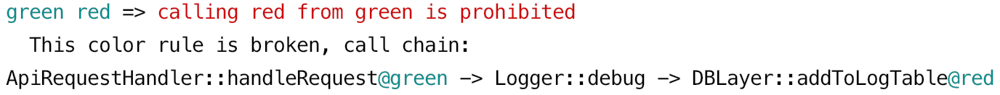

# Getting started

In this short tutorial, we'll create a new project in a copy-paste manner, and launch NoColor on it.


## Step 0 — install NoColor if you haven't

[Installation](/docs/install.md). The easiest way is just to download a ready binary.


## Step 1 — create a folder with index.php

Create a folder `testcolors`:
```bash
mkdir testcolors
cd testcolors
```

Create a file `index.php` inside it:
```php
<?php

class ApiRequestHandler {
  /**
   * We want this function to be as fast as possible
   * Let's assume that "fast" functions are green
   * @color green
   */
  function handleRequest() {
    $logger = new Logger;
    $logger->debug('Processing request');
  }
}

class Logger {
  function debug(string $msg) {
    DBLayer::instance()->addToLogTable([
      'time'    => time(),
      'message' => $msg,
    ]);
  }
}

class DBLayer {
  static public function instance() {
    return new DBLayer;
  }

  /**
   * We know this function is slow due to DB insertion
   * Let's assume that "slow" functions are red
   * @color red
   */
  function addToLogTable(array $kvMap) {
    // suppose we insert to DB here
  }
}
```

Look closer to this file: `handleRequest()` calls `debug()`, which calls `addToLogTable()`.

We also have `green` and `red` colors marking two functions using the `@color` PHPDoc tag.


## Step 2 – `nocolor init`

Just run 
```bash
nocolor init
```

This command will create the `palette.yaml` file with default contents. 
Those default contents is a starter, to do by analogy with. In particular, it contains a rule for *green* and *red* colors, that's why this demo works. 


## Step 3 — `nocolor check`

Just run
```bash
nocolor check
```

This will lead to an error:

<p align="center">
    
</p>

Why did this error appear? Examine the code in `index.php`, and you'll see that the *green* `handleRequest()` implicitly calls the *red* `appendLogToTable()`, which is forbidden by this rule in `palette.yaml`:
```yaml
green red: calling red from green is prohibited
```

NoColor has found this call chain and has shown exactly the same it was asked about.


## Step 4 — further reading

Proceed to the next page — [Introducing colors](/docs/introducing_colors.md). 
 
While reading, you will be hinted to modify `index.php` several times, so keep it as a live demo.


## Step 5 — console options, etc.

They can be found in the [Configuration](/docs/configuration.md) page.

