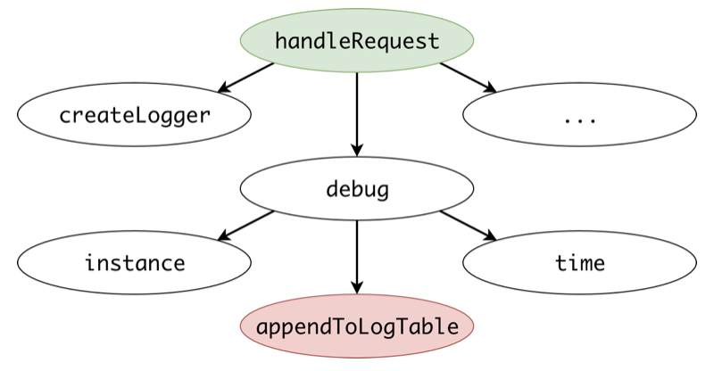

# Introducing colored functions

The idea behind NoColor is pretty simple:
* **colors** define some properties of functions
* **the palette** describes the rules for mixing colors

Color mixing means the **combination of colors produced by function calls**.

Let's write code, when the *green* `f1` calls `f2`, and `f2` calls the *red* `f3`:
```php
/** @color green */
function f1() { f2(); }

// this function has no color (by default)
function f2() { f3(); }

/** @color red */
function f3() { /* ... */ }
```

It can be visualized in a call graph:

<p align="center">
    
</p>

`f2` has no colors: it is *transparent*. A call chain `f1 -> f2 -> f3` is transformed into a color chain `green transparent red`. Without `f3`, a call chain `f1 -> f2` is just `green transparent` of course.

Let's say we want to prohibit calling *red* functions from *green*. We express it with the following rule in **the palette**:
```yaml
green red: calling red from green is prohibited
```

`f1` alone doesn't match this rule, `f1 -> f2` also, but `f1 -> f2 -> f3` matches:

<p align="center">
    
</p>

It works like pattern matching. A color chain `green yellow blue red` would have also matched the `green red` rule. 

 
<p><br></p>

## Start thinking in colors: find performance leaks

Let's assume, that we have some *slow* functions (which do DB inserts or other slow work), and we have some *performance critical* (or *fast*) functions, that are supposed to be executed as fast as possible. 

To make it visual, let's state, that *slow functions are red, fast functions are green*:

<p align="center">
    
</p>

What's a performance leak in this terminology? **A performance leak is when a red function is called from a green one**. We have seen this a bit earlier, right? 

Let's get closer to some real code snippet:
```php
// class ApiRequestHandler, a green function
function handleRequest(DemoRequest $req) {
    $logger = createLogger();
    $logger->debug('Processing ' . $req->id);
}

// class Logger
function debug(string $msg) {
    DBLayer::instance()->addToLogTable([
        'time'    => time(),
        'message' => $msg,
    ]);
}

// class DBLayer, a red function
function addToLogTable(array $kvMap) {
    // ...
} 
```

If we draw its call graph, we'll see this:

<p align="center">
    
</p>

This is a potential performance leak! 


<p><br></p>

## Not just *red* and *green*, but anything you want

The secret is that we used red and green *only* to visualize the metaphone "red are slow, green are fast".

But! We can use **slow** and **fast** as colors directly:
```php
/** @color slow */
function appendLogToTable() {}

/** @color fast */
function handleRequest() {}
```

What we want to express is this exact pattern:
```yaml
fast slow: potential performance leak
```

**Anything can be a color**, any attribute you can think of:

* *slow*, *fast* or *performance-critical*
* *server-side-rendering*, or just *ssr*
* *view* and *controller*
* *db-access*
* ... and everything else

A function can even have multiple colors simultaneously. For example, *api-entrypoint* and *slow*.


<p><br></p>

## The Palette: it describes colors mixture

We have already written a color rule above, like this:
```yaml
fast slow: potential performance leak
```

It's **a rule in the palette**. It describes directly what it says: calling a slow function from a fast one is an error, but vice versa is okay.

What else can we describe? Any patterns we want! For example, controllers may not depend on models:
```yaml
controller model: controllers may not depend on models
```

Once we have all our controllers annotated by the `@color controller`, and the same for models, NoColor will check dependencies for this rule at any depth.

Some other examples:
```yaml
ssr db: don't fetch data from server-side rendering

api-entrypoint curl-request: performing curl requests on production is bad practice

green yellow red: a strange semaphore in your code
```

The palette is described in the `palette.yaml` file. We'll explain its format a bit [below](#format-of-the-paletteyaml-file).


<p><br></p>

## Okay, it's the way to *deny* some patterns, but how to *allow* exceptions?

We want to express something like *"I know, that accessing DB from SSR is bad, but please, let me allow this just here"*.  
Or, *"Calling a slow method is not a performance leak here, because it's surrounded with `if(debug)`"*.

In our example, how to allow calling the `Logger::debug()` method regardless of the rule `fast slow`?

**Color rules are close to CSS styling**. This analogy is not 100% correct, but it helps understand the concept of exceptions. 

Here is the trick. Think of calling methods like nesting HTML elements, where colors are classes:

<p align="center">
    
</p>

If we try to express "performance leak" it in CSS manner, we'd do it like this:
```css
.fast .slow {
    error-text: "potential performance leak";
}
```

Of course, we can use deeper nesting in CSS rules, like `.red .green .blue`. What's the most important, we can write more specific selectors, that override this property:
```css
.green .red {
    error-text: "don't call red from green";
}

.green .yellow .red {
    error-text: "a strange semaphore in your code";
}
```

It's a very intuitive CSS: if a yellow function is between green and red, this call chain will emerge another value of `error-text`. And...
```css
.green .yellow .red {
    error-text: none;
}
```

Thinking in CSS way, we could just clear that error in a more specific selector. So, you guess this, right?
```css
.fast .slow-ignore .slow {
    error-text: none;
}
```

**Color rules work pretty much the same. You write more specific selectors in the palette, which suppress a general error**. Here is how it looks in `palette.yaml` actually:
```yaml
analyze performance:
- fast slow: potential performance leak
- fast slow-ignore slow: ""
```

So, how to allow calling `Logger::debug()` from *fast*-colored functions? Just in this way:
```php
/**
 * @color slow-ignore
 */
function debug() { /* ... */ } 
```

**Another example**. Let's enrich a rule from the above about server-side rendering:
```yaml
Check server rendering:
- ssr db: don't fetch data from server-side rendering
- ssr allow-db db: ""
```

<p align="center">
    
</p>

Notice, that NoColor checks all reachable paths in a call graph. For instance, if there is another way to reach `h` from `f`,

<p align="center">
    
</p>

only the first chain will be suppressed, and the second will lead to an error, as should:
```
f g2 h => don't fetch data from server-side rendering 
```


<p><br></p>

## `@color` can be placed above classes

If the `@color` PHPDoc tag is places above a class, it works like if it was placed above every method of this class.
```php
/**
 * @color low-level
 */
class ConnectionCache { /* ... */ }
```

Since colors are arbitrary strings, **namespaces can be used like colors**:
```php
/**
 * @color VKApi\Handlers
 */
class AuthHandler { /* ... */ }

/**
 * @color VKDesktop\Templates
 */
function tplPostTitle($post) { /* ... */ } 
```

Hence, you can easily describe patterns you want to avoid:
```yaml
VKApi\Handlers VKDesktop\Templates: using UI from api is strange
```

Functions and classes are not auto-colored with namespaces: you still need to append the `@color` above the exact you want.


<p><br></p>

## Simulating `internal` classes with colors

In PHP, all classes are public, and all public methods can be called from anywhere. Even if you encapsulate some internal logic within a helper class, it's can be used directly from any part of your code.
```php
namespace DBLayer\Internals;

// you suppose that external code doesn't use this class directly
class LegacyIDMapper {
    static function mapUserId($user_id) { /* ... */ }
}
```
```php
namespace DBLayer\Transformers;

// you have a high-level wrapper, you want it to be used
function transformLegacyUser(User $user) {
    $user->id = LegacyIDMapper::mapUserId($user->id);
    // ...
}
```

The problem is, that anyone can use `LegacyIDMapper` directly, which can't be prohibited by the language.

How to solve this problem with colors? In a wonderful way :) Let's introduce two colors:
```php
/**
 * @color db-internals
 */
class LegacyIDMapper { /* ... */ }

/**
 * @color db-public
 */
function transformLegacyUser(User $user) { /* ... */ }  
```

And add these ruleset to the palette:
```yaml
Implementing internal keyword for DBLayer:
- db-internals: don't access db implementation layer directly
- db-public db-internals: ""
```

We are done! NoColor will now find any direct calls. Of course, you could use namespaces like colors here also. Of course, if you really-really want to call an internal method from a particular function, you could add a rule
```yaml
please-allow-internals-here db-internals: "" 
```
Mark your exact function with this special `@color` — doing this puts your purpose into shape, and code reviewers also see this intention.  


<p><br></p>

## A function can have many colors at once

This syntax is pretty much valid:
```php
/**
 * @color ssr
 * @color allow-db
 */ 
```
It's not a bug, it's a feature, because colors are something like "tags" that are independent. The order of `@color` tags matters: when a call chain is converted to a color chain, all colors are appended in this order.

Note, that you should write many `@color` PHPDoc tags instead of enumerating colors in one tag:
```
// that's wrong!
@color ssr allow-db

// this is correct:
@color ssr
@color allow-db
```

This is done intentionally: to find all occurrences of a particular color, you need just to perform a full-text search for `@color {name}` in your project.

Here is another, tricky example:
```yaml
- api-entrypoint curl-request: performing curl requests on production is bad practice
- api-entrypoint curl-request please: ""
```

A color *please* can suppress the error above **if and only if** it's used with the *curl-request* color. Unlike *allow-db*, which should occur somewhere upwards a call chain, the *please* color must occur at the very same place:

<p align="center">
    
</p>


<p><br></p>

## Conflict resolution if many rules are matched

Say, we have these rules (we've earlier seen these examples):
```yaml
- fast slow: potential performance leak
- ssr db: don't fetch data from templates
- ssr allow-db db: "" 
```

And such a call chain:

<p align="center">
    
</p>

On the one hand, this call chain matches `fast slow` is an error. From the other, it matches `ssr allow-db db` that clears an error. How does NoColor deal with such cases?

Here is the thing. When you think about performance leaks, you think of rules and exceptions describing this particular pattern. When you touch ssr, you don't concern anything else. In other words, **these are two independent lists of rules**, which must work separately.

When you write `palette.yaml`, you actually operate different lists:
```yaml
finding performance leaks:
- # rules for fast / slow 
- # with exceptions
  
preventing data fetching from ssr:  
- # rules for ssr / db / rpc 
- # with exceptions
```


<p><br></p>

## Format of the `palette.yaml` file

Here is a working example. Two rulesets, with two rules in each:
```yaml
finding performance leaks:
- fast slow: potential performance leak 
- fast slow-ignore slow: ""

# you can add optional comments in yaml
preventing data fetching from ssr:  
- ssr db: don't fetch data from templates 
- ssr allow-db db: ""
```

In .yaml syntax, it's a map from a string key (ruleset description) to a list (rules of that ruleset). 

On the top-level, there are one or more rulesets. Each ruleset is a list of color mixing rules. Each rule is a string key, and a string value. A key is a color pattern to be matched against every call chain. A value is an error message, or an empty string, meaning there is no error.

The necessity of having multiple rulesets comes from conflict resolution, as mentioned above. Making every ruleset a list (not a sub-object without dashes) is also important, because the order of rules is meaningful (in case of a sub-object, that order would be missed).

Since it's a .yaml format, you can use quotes if you prefer. 

*Transparent* color and wildcard can't occur in selectors.  


<p><br></p>

## A special `@color remover`

A *remover* is a special color: when mixed, it dissolves all previous colors: **T + remover = transparent**. More precisely, it fully removes this function from the call graph, as if it doesn't exist at all.

In large projects there may be "bottleneck" functions in a call graph: lots of other functions are reachable from them, and they are reachable from a large scope.

```php
function router($page) {
    if ($page === 'about') displayPageAbout();
    else if ($page === '500') displayInternalServerError();
    else if ($page === 'profile') displayPageProfile();
    // 1000+ cases, probably codegenerated    
}

function respondWithError() {
    router('500');
}
```

`respondWithError()` is called from many places when the execution can't be recovered, but the whole site is reachable from it because of `router()`. A huge part of a call graph becomes a one big connectivity component, where every function is reachable from any another. This breaks almost every color rule, as NoColor finds a connection through routing.

To manage this, we may exclude `router()` from a call graph completely, which splits one connectivity in many:
```php
/** 
 * @color remover
 */
function router() { /* ... */ } 
```

Hopefully, you'd never need this color in your projects.


<p><br></p>

## Limitations and speed

The number of groups, colors and selectors in unlimited, though the more functions are colored — the slower NoColor would work. That's the main reason why namespaces are not auto-colored: when a full call graph is colored, a combinatorial explosion of different colored paths occur. A suggestion is to **colorize only those patterns that you really want to check** (typically 99% of functions are supposed to be left transparent).  

All available call chains are calculated **on a static analysis phase**, there is no runtime overhead. NoColor uses some tricky internal optimizations to avoid useless depth searching in a call graph. Every possible colored call chain is matched against all rules in the palette.

Remember, that **PHP is an interpreted language** and allows constructions that can't be statically analyzed. If you write something like `SomeClass::$any_function()` or `new $class_name`, NoColor can't do anything about it.

**Recursive components** in a call graph are implicitly joined into one graph node with all colors merged. Hence, if a part of your call graph looks like this:

<p align="center">
    
</p>

NoColor won't deeply analyze such construction: it will just assume *"everything is reachable from everything inside it"* and join it into one graph node colored with both *green* and *red*. That's the reason behind a `@color remover` described earlier: it helps split recursive components.

Also, NoColor deeply analyzes your code by performing **type inferring**, that's why it could be found a bit slower than Deptrac, which doesn't have such an option.


<p><br></p>

## Type inferring

NoColor analyzes not only `A::staticMethod()` calls, but `$a->instanceMethod()` call also. To make this possible, we need to know the type of `$a` to correctly locate the class containing `instanceMethod`. 

NoColor is built on top of [NoVerify](https://github.com/VKCOM/noverify) (a PHP linter from VK.com Team) and therefore includes lots of logic to infer types in your PHP code. It analyzes PHPDocs, simple control flow, array access, foreach and so on. 
```php
/**
 * @param A[][] $matrix
 */
function f($matrix) {
    foreach ($matrix as $row) 
        $row[0]->method();       // bound correctly to A::method()
} 
```

If you face some problem with inferring, you can always help NoColor by adding the `@var` PHPDoc:
```php
function debug(array $options) {
  /** @var DBLayer $logger */
  $logger = $options["logger"];
  $logger->addToLogTable(...);
}
```

<p><br></p>

## NoColor vs Deptrac

Both NoColor and Deptrac focus on architecture validation patterns, but coloring is a much more flexible approach that allows you to describe arbitrary patterns you want to check for, as well as exceptions for them. 

Moreover, NoColor searches for calls at any nesting level and supports type inferring and instance methods.

<p align="center">
    
</p>

Continue reading about NoColor vs Deptrac comparison [on a separate page](./comparison_with_deptrac.md).
